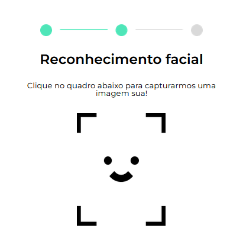
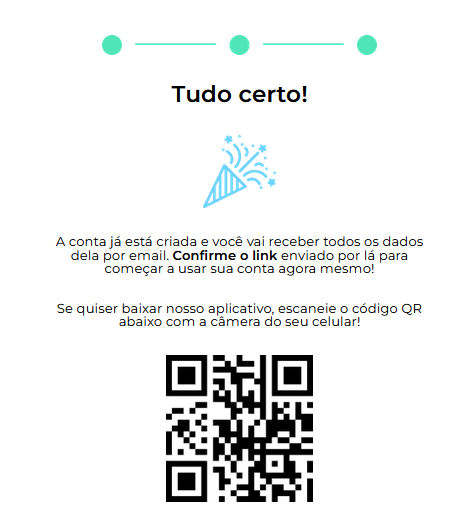

## 💳 MoniBank

O **MoniBank** é um site fictício de banco onde é possível criar uma nova conta de forma totalmente **segura e interativa**. O projeto faz **validações** aprofundadas no formulário (HTML5 e JavaScript), verifica dígitos do CPF, confere se o usuário é maior de idade, exibe **mensagens customizadas de erro** e finaliza com um passo de **reconhecimento facial** via webcam, antes de confirmar a criação da conta.

 

## 🚀 Sobre o Projeto

Este projeto foi desenvolvido durante o curso da Alura:

* "JavaScript: validando formulários"

O Monibank transforma uma página estática em um fluxo completo de cadastro de conta bancária, aplicando **validações nativas e personalizadas**, **integração com a webcam** do usuário e **persistência de dados** no navegador.

## 📚 Objetivos do Curso

* Saber como aplicar **atributos de validação** de formulário com HTML5;
* Construir validações para os dígitos verificadores do CPF;
* Implementar validações de maioridade a partir da comparação de datas;
* Customizar **mensagens de erro** para cada tipo de campo do formulário;
* Integrar a webcam do usuário em uma tela do navegador;
* Capturar fotos via webcam;
* Salvar e editar dados salvos no navegador.

## 🛠️ Tecnologias Utilizadas

## 🖼️ Visualização do Projeto

Uma prévia das principais funcionalidades do **MoniBank**:

**🌐 Acesse o Projeto Online**

O projeto está disponível para visualização na **Vercel**. Clique no link abaixo para acessar:

**📝 Formulário de Criação de Conta**

O usuário preenche nome, e‑mail, CPF, data de nascimento e outros campos, com validações ativas nos inputs.

**📸 Reconhecimento Facial**

Após o formulário ser validado, a webcam é ativada para capturar a foto do usuário e concluir a verificação de identidade.

**✅ Confirmação de Conta Criada**

Se tudo estiver correto, é exibida uma mensagem de sucesso confirmando a abertura da conta.

